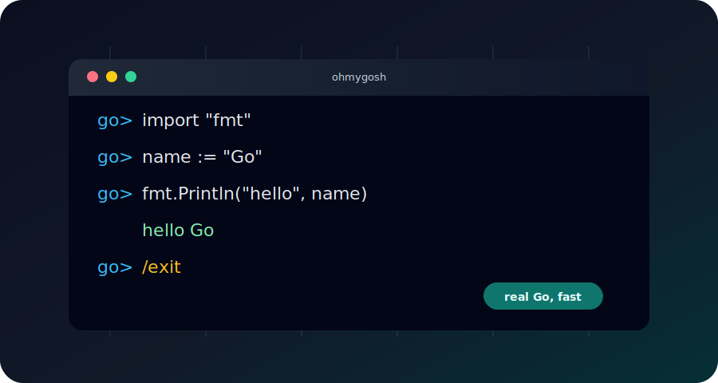

# ohmygosh

An interactive Go prompt for trying small snippets without setting up a scratch
file.

<p align="center">
  
</p>

## What It Does

`ohmygosh` gives you a tiny Go REPL:

- Run one Go statement at a time.
- Keep top-level declarations between prompts.
- Keep imports and only include them when they are used.
- Preserve prior statements so later input can refer to earlier variables.
- Exit with `/exit` or Ctrl-D.

## Install

Install the latest version with:

```sh
go install github.com/ivange94/ohmygosh/cmd/gosh@latest
```

Then run:

```sh
gosh
```

Or build from a cloned checkout:

```sh
go build -o gosh ./cmd/gosh
```

Then run the local binary:

```sh
./gosh
```

## Usage

```text
ohmygosh interactive Go prompt. Use /exit or Ctrl-D to exit.
go> import "fmt"
go> name := "Go"
go> fmt.Println("hello", name)
hello Go
go> /exit
```

## Commands

```text
/help   show REPL help
/exit   exit the prompt
/quit   exit the prompt
/q      exit the prompt
```

## Notes

This is intentionally small. It shells out to `go run` in a temporary directory,
so it behaves like real Go instead of implementing its own evaluator.
